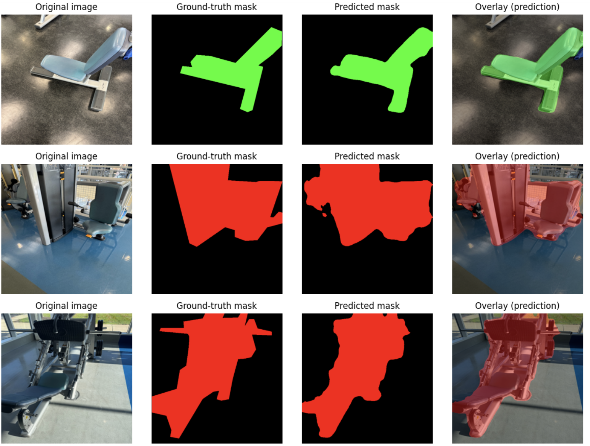
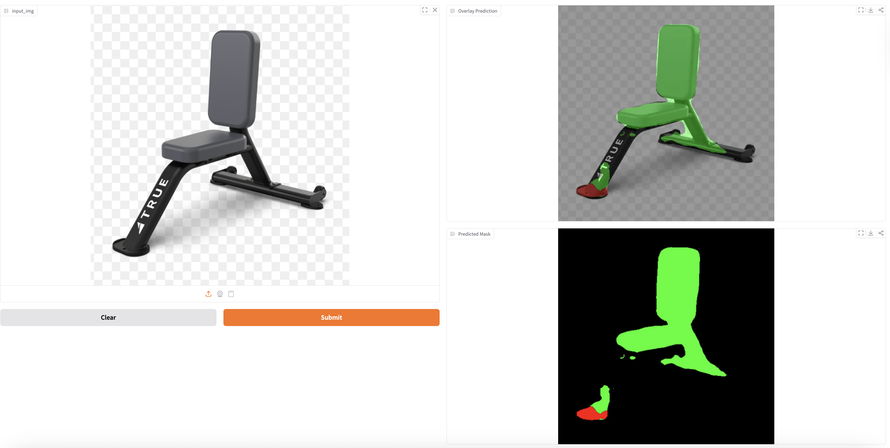
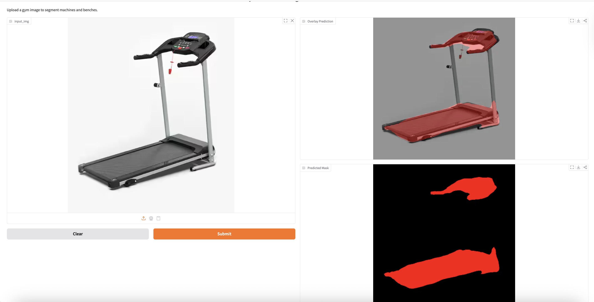

# 🏋️ Indoor Gym Equipment Semantic Segmentation

Pixel-level semantic segmentation of indoor gym equipment using **DeepLabV3-ResNet50** and **DeepLabV3-ResNet101** in PyTorch.

---

## 🚀 Project Overview

This project performs **semantic segmentation** to classify each pixel in an indoor gym image into one of three classes:

- **0 – Background**
- **1 – Machine**
- **2 – Bench**

The goal is to automatically identify and isolate gym equipment to support:

- Indoor navigation systems  
- Equipment inventory monitoring  
- Accessibility assistance tools  

---

## 📊 Dataset

- 200 RGB images captured at the University of New Haven Recreation Center  
- Manually annotated using LabelMe  
- Converted from JSON polygons → indexed PNG masks  
- Original resolution: 5000 × 5000  
- Resized to 512 × 512 for training  

### Class Mapping

| Class | ID |
|-------|----|
| Background | 0 |
| Machine | 1 |
| Bench | 2 |

### Data Split

- Train: 160 images (80%)  
- Validation: 20 images (10%)  
- Test: 20 images (10%)  

---

## 🧠 Model Architecture

### Baseline Network
- DeepLabV3 with ResNet-50 backbone (pretrained on COCO)
- Final classifier replaced with 3-class output layer

### Training Configuration
- Optimizer: Adam  
- Learning rate: 1e-4  
- Weight decay: 1e-5  
- Batch size: 8  
- Epochs: 15  
- Loss function: Cross-Entropy  
- Evaluation metric: Mean Intersection-over-Union (mIoU)  

---

## 📈 Experimental Results

| Model | Validation mIoU |
|-------|------------------|
| Pretrained (No Training) | 0.34 |
| Fine-Tuned ResNet50 | 0.90 |
| Regularized ResNet50 | 0.76 |
| ResNet101 Backbone | 0.86 |

Fine-tuning the full DeepLabV3-ResNet50 backbone achieved the best performance with **0.90 validation mIoU**.

---

## 🧪 Data Augmentation (Training Only)

- Random horizontal flip (p = 0.5)  
- Random vertical flip (p = 0.5)  
- Random 90° rotations  
- Color jitter (brightness/contrast/saturation adjustments)  

---

## 🖼️ Example Predictions

### Ground Truth vs Prediction Comparison


### Real-World Inference (Bench – HuggingFace Demo)


### Real-World Inference (Machine – HuggingFace Demo)


---
## 🎨 Color Legend

The segmentation output uses the following class color mapping:

- 🟢 **Green** → Bench  
- 🔴 **Red** → Machine  
- ⚫ **Black** → Background  

---

## 🌐 Live Demo

An interactive demo is available on HuggingFace Spaces:

👉 https://huggingface.co/spaces/YawNimo/gym-machine-segmentation-demo

---

## 🛠️ How to Run Locally

Clone the repository:

```bash
git clone https://github.com/YawNimo/gym-equipment-semantic-segmentation.git
cd gym-equipment-semantic-segmentation
```

Install dependencies:

```bash
pip install -r requirements.txt
```

Run the application:

```bash
python app/app.py
```

---

## 📄 Project Report

Full project presentation available here:

Semantic Segmentation for Gym Equipment (PDF included in repository)

---

## 👨🏾‍💻 Authors

- Yaw Nimo-Agyare  
- Lokesh Umamaheswari Ethirajan  
- Tirth Nileshbhai Chheta  

---

## 📌 Technologies Used

- Python  
- PyTorch  
- DeepLabV3  
- ResNet50 / ResNet101  
- OpenCV  
- NumPy  
- LabelMe  
- HuggingFace Spaces  

---
